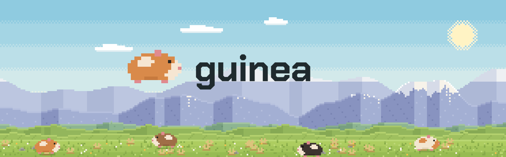

<div align="center">



*The application layer for Rust GUI.*

</div>

### What guinea is

An opinion about how a desktop application is built, and the machinery that
makes the opinion cheap to follow.

- **An architecture** - state is a reducer, the domain is actors that change it, and a feature owns both. A page is written the way its toolkit works; whatever it is, it reads what it may, and asks a feature for the rest
- **Routing after Next.js** - nested layouts and pages, declared once in `routes!`. A layout stays mounted while the pages under it change, and what it installs lives exactly as long as it does
- **Plugins** - a feature is the unit of reuse: installed by any page or layout, in any application, and gone with it. [guinea-plugins](https://github.com/guinea-rs/guinea-plugins) is what a desktop needs, written once
- **Infrastructure for free** - guinea knows how the application is put together: which feature a page installed, which actor answered, what a message caused. So nothing has to be wired by hand for structured tracing with cause chains, tests after gpui's with background work ordered by a seed, and devtools that show the application live

### Features

- **Typed routes** - the route tree is an enum `routes!` writes; navigation takes a value, not a path. Paths exist only where a deep link or a restored session needs one, and the compiler checks every field survives the round trip
- **Scoped lifetimes, known at compile time** - a feature lives exactly as long as the page or layout that installed it, and the route tree says at build time what is alive where: its actors, timers and subscriptions end when the user leaves
- **Reads checked at build time** - a page reads what it installed itself and what a layout above it exports; anything else is a compile error at the read, not a panic at the first render
- **The toolkit's own model on the page, actors in the domain** - on WinUI and iced a page is an Elm node with messages and one `update`, on egui and ratatui it draws itself every frame, on Slint the view is the `.slint` file and Rust wires it; the domain behind any of them answers actions through actors, and pushes state back through reducers
- **Deterministic tests** - `#[guinea::test]` runs a test once per seed, with background work interleaved the way the seed says. WinUI pages mount without a window, and are clicked and read back as a tree
- **What caused what** - every action, message, publication and state change is traced with its cause, to `tracing` as structured events and to devtools as a live graph
- **Five backends** - WinUI (through `windows-reactor`), ratatui, Slint, egui and iced, behind one domain

> [!WARNING]
> **guinea is young, and its API still moves between minor versions.**
> WinUI is the backend a real application ([uniproc](https://github.com/uniproc-dev/uniproc)) runs on every day; the other four
> run the same example application and are tested, but nobody depends on them yet.

<!-- shown: counter -->
```rust
use guinea::prelude::*;
use guinea::winui::{Page, PageCx, Window, page, run};
use guinea::winui::reactor::{Button, ChildrenControl, ContentControl, StackPanel, TextBlock, View};

/// The state.
#[derive(Default, Clone, PartialEq, Debug)]
pub struct Count(pub u32);

/// How it changes.
#[reducer]
fn count(this: &mut Count, by: u32) {
    this.0 += by;
}

/// What the UI asks for.
pub struct Add(pub u32);

/// The domain: answers `Add`, and pushes the new state.
#[derive(Debug)]
pub struct Counting {
    push: Push<Count>,
}

actor! {
    Counting {
        handlers { Add }
    }
}

#[handler]
fn add(this: &mut Counting, Add(by): Add) {
    this.push.send(by);
}

// What the feature publishes to the pages that install it, or sit below.
feature! {
    pub Counter {
        exports { Count }
    }
}

#[installs]
fn counter(cx: &FeatureInitContext) -> anyhow::Result<Counter> {
    let (count, _) = cx.state::<Count>().driven_by(|push| Counting { push });
    Ok(Counter(count))
}

#[derive(Default)]
pub struct Home;

#[page]
impl Page for Home {
    type Installs = Counter;

    fn install(ctx: &FeatureInitContext, _params: &()) -> anyhow::Result<Counter> {
        ctx.install(&())
    }

    fn view(&self, cx: &mut PageCx<'_, Self>) -> View {
        let (count, dispatch) = cx.read::<Count, _>();

        StackPanel::new()
            .children((
                TextBlock::new().text(count.0.to_string()),
                Button::new()
                    .on_click(move || dispatch.emit(Add(1)))
                    .content(TextBlock::new().text("Add")),
            ))
            .into()
    }
}

routes! {
    Route {
        page(Home) { }
    }
}

fn main() -> anyhow::Result<()> {
    run(GuineaApp::new(), Window::new().title("Counter"), |_| {
        Route::Home {}
    })
}
```
<!-- /shown -->
